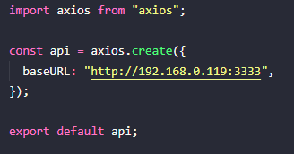

<h1 align="center">
    
</h1>


## 💻 Project proposal

Project developed during the 5th edition of the Next Level Week of Rocketseat- ReactNative Trail.

## 🧪 Technologies

This project was developed using the following technologies:

- [React Native](https://reactnative.dev/)
- [Expo](https://expo.io/)
- [TypeScript](https://www.typescriptlang.org/)

<h2>
  📌 To have a copy of the project
</h2>

### Clone the repository to have a copy of the code on your machine

```bash
$ git clone https://github.com/DeboraZandonai/PlantManager && cd PlantManager
```

### Load dependencies

```bash
$ yarn install
```

### Running the Json-server

The json server will give access to the images.

**To install**

```bash
$ yarn add -g json-server
```

**or**

```bash
$ npm install -g json-server
```

**To run it**

```bash
$ json-server ./src/services/server.json --host 192.168.0.119 --port 3333
```

Note that the local ip 192.168.0.119 is mine, you must replace it with yours, to find out what your ip is, just go to your cmd and run the following command:

```bash
$ ipconfig
```

NOTE: Choose the option: IPv4 address.
<br/>

## Change the ip address in the api

<br/>



## Run the project

```bash
$ expo start
```

After doing this, the metro bundler will open in your browser. Some options for running the Application:

#### 1 - Android emulator

On the metro bundler page, click on "Run on Android device / emulator" and wait to load. Keep in mind that it is necessary to have gone through the process of installing the android sdk, etc.

#### 2 - IOS Emulator

On the metro bundler page, click on "Run on iOS simulator" and wait to load.

#### 3 - Your smartphone

Download the Expo app:

- [iOS](https://itunes.apple.com/app/apple-store/id982107779)
- [Android](https://play.google.com/store/apps/details?id=host.exp.exponent&referrer=www)

After downloading, go back to the metro bundler page and scan the QR Code with the Expo app.

<em>For more details on how to run the app on an emulator or on your physical device, click <a href="https://react-native.rocketseat.dev/">on here</a>.</em>
<br />

## 📝 Licença

This project is under the **MIT** license. For more information, access the file [LICENSE](https://github.com/DeboraZandonai/PlantManager/blob/master/LICENSE).

<h4 align=center>Made with ❤️ by <a href="https://www.linkedin.com/in/debora-zandonai-4ab092195/">Debora Zandonai</a></h4>
